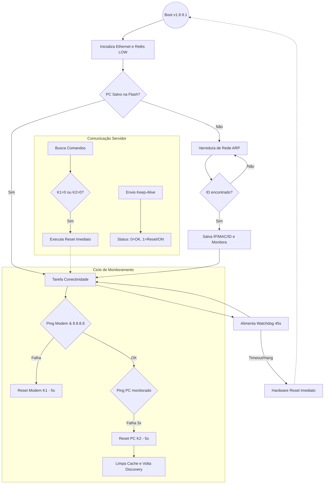

# Documentação Técnica - Smart Ruler (SMR) v1.9.9.1

Este documento detalha a lógica de funcionamento, protocolos de rede e arquitetura de software do Smart Ruler (SMR).

## 1. Arquitetura de Hardware e Relés

O SMR utiliza quatro relés para controle de energia. A lógica de hardware é **padronizada** para todos os pinos para garantir segurança e previsibilidade.

- **Lógica Digital**:
  - **LOW (0)**: Energia Ligada (127V liberado). É o estado de repouso padrão.
  - **HIGH (1)**: Energia Cortada (Desligado ou em ciclo de Reset).

### Mapeamento de Pinos
| Componente | Pino GPIO | Função |
| :--- | :--- | :--- |
| **Relé Modem (K1)** | 14 | Controle de energia do Modem/Gateway |
| **Relé PC (K2)** | 32 | Controle de energia do PC/NUC |
| **Relé Auxiliar (K3)** | 12 | Saída auxiliar programável |
| **Relé Auxiliar (K4)** | 33 | Saída auxiliar programável |

---

## 2. Monitoramento de Conectividade

O sistema opera três tarefas independentes em paralelo (FreeRTOS):

### A. Monitoramento do Modem (Conectividade Global)
1. **Ping Local**: Testa o IP do Gateway (`modemIP`).
2. **Ping Internet**: Se o local responder, testa o IP **8.8.8.8**.
3. **Reset Automático**: Se houver falha total, o SMR corta a energia do modem por **5 segundos** e religa.
4. **Proteção**: Aguarda **5 minutos** entre resets e **3 minutos** após um reset (*cooldown*) antes de testar novamente.

### B. Monitoramento do PC (Monitoramento Garantido)
O SMR utiliza um sistema de "Identidade de Máquina":
1. **Discovery (Busca)**: Escaneia a rede via ARP.
2. **ID Verification**: Ao achar um IP, o SMR busca o arquivo `dispositivo.json` no PC.
3. **Validação**: O monitoramento só começa se o `deviceID` for encontrado e validado.
4. **Watchdog de Rede**: Se o PC (conhecido pelo ID) falhar 3 vezes, o SMR executa o reset físico da tomada K2.

---

## 3. Protocolo de Comunicação (Payloads)

Os dados enviados para a plataforma seguem o mapeamento digital binário:

### Status de Modem e PC
- **"1" (Reset)**: Indica que um reset ocorreu ou foi detectado.
- **"0" (OK)**: Indica funcionamento normal (Energia ON).

### Status de K3 e K4
- **"1" (ON)**: 127V liberado na tomada.
- **"0" (OFF)**: Energia cortada.

---

## 4. Watchdog (WDT) de Sistema

Para garantir que o SMR nunca "trave", implementamos um Watchdog de hardware com timeout de **45 segundos**:
- **Monitoramento de Tarefas**: Todas as tarefas (Connectivity, Status, Commands) devem "avisar" ao WDT que estão vivas.
- **Ação de Falha**: Se qualquer tarefa travar por mais de **45 segundos**, o hardware do ESP32 força um **Reboot Imediato** para recuperar o sistema.
- **Proteção de Loops**: Em processos longos (como varredura de rede /24), o WDT é resetated internamente para evitar disparos falsos.

---

## 5. Fluxograma de Operação

---

## 6. Comandos Aceitos (Servidor -> SMR)

| Comando | Valor | Ação |
| :--- | :--- | :--- |
| **K1** | 0 | **Reset do Modem** (Corte 5s -> ON) |
| **K2** | 0 | **Reset do PC** (Corte 5s -> ON) |
| **K3** | 0 | **Ligar** Tomada Auxiliar |
| **K3** | 1 | **Desligar** Tomada Auxiliar |
| **K4** | 0 | **Ligar** Tomada Auxiliar |
| **K4** | 1 | **Desligar** Tomada Auxiliar |
